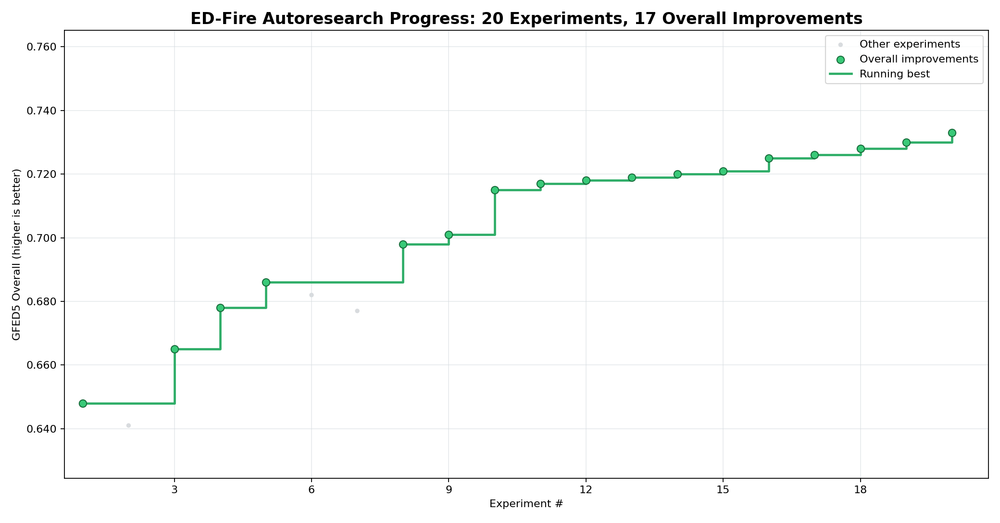

# ED-Fire

ED-Fire tests whether autoresearch can develop a better fire module for the [Ecosystem Demography model](https://gel.umd.edu/ed.php). Global fire models still struggle to reproduce where fire occurs, when it peaks, and how much land burns. The research loop proposes interpretable changes to the model's equations, fits their parameters, and tests each formulation against satellite observations.

The model predicts monthly burned area from climate, vegetation, land use, population, and lightning. GFED5 and ILAMB measure whether a proposed mechanism improves the global spatial pattern, seasonal cycle, magnitude, and performance across 14 regions. The aim is to discover physical formulations for fuel availability, fuel moisture, ignition, spread, and human influence that improve the observations without turning the model into a black box. More context is available on the [Exaforge Earth System Models project page](https://exaforgelabs.com/research/projects/earth-system-models/).



## Autoresearch context

The research loop works entirely inside this directory:

```text
autoresearch/
├── inputs/                 prepared monthly inputs on the shared 2001–2016 global grid
│   ├── climate.nc          temperature, precipitation, and accumulated dryness
│   ├── ed.nc               frozen ED vegetation and ecosystem state
│   ├── lightning.nc        monthly lightning climatology
│   ├── luh2.nc             land-use and land-cover fractions
│   ├── population.nc       population density
│   └── README.md           input variables, provenance, units, and usage
├── model.py                the one editable mechanistic fire model
├── research.md             instructions for the autoresearch loop
└── results.tsv             official GFED5 experiment ledger and model checkpoints
```
