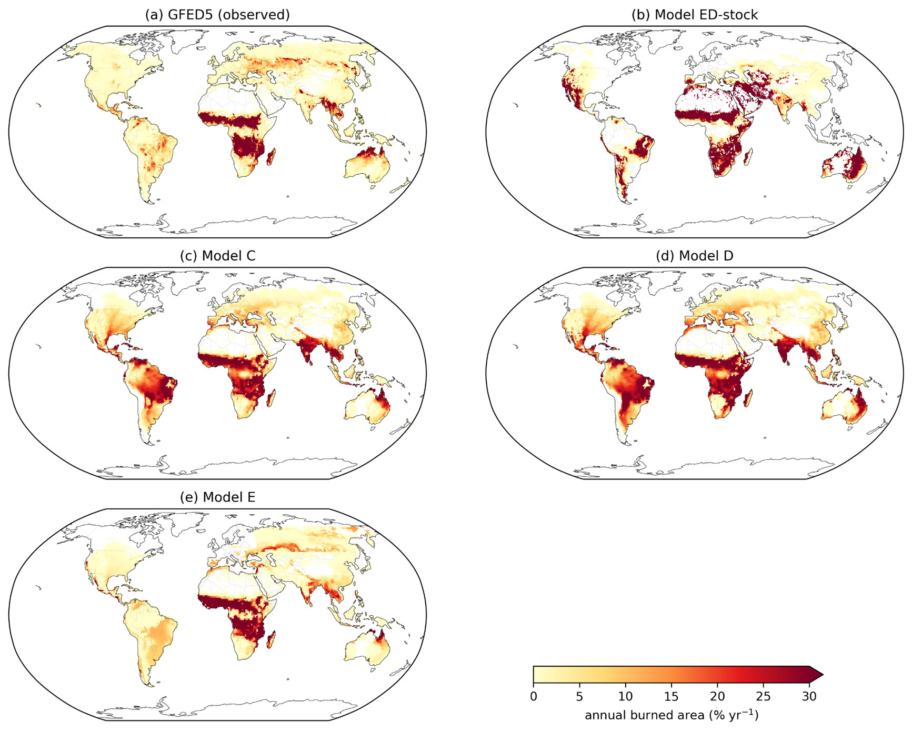

# Paper manuscript (Markdown → Typst → PDF)

**Edit `paper.md` only.** On save, the PDF rebuilds. Figures live in `figures/`. Bibliography is `refs.bib`.

`paper.typ` is generated by `build.py` — do not hand-edit it. Layout (spacing, fonts, margins) is controlled in `build.py`.

---

## One-time setup

1. Install [Typst](https://typst.app/) (compiler):

   ```bash
   brew install typst
   ```

2. Confirm tools:

   ```bash
   typst --version    # need 0.11+
   python3 --version  # system Python 3 is enough (no pip packages)
   ```

3. From the repo root (or any machine with this folder):

   ```bash
   cd paper
   python3 build.py   # smoke test: writes paper.typ + paper.pdf
   ```

---

## Live edit (autosave → PDF)

Leave a watcher running in a terminal, then edit and save `paper.md` in any editor.

```bash
cd paper
python3 watch.py
```

What it does:

- Watches `paper.md`, `refs.bib`, and everything under `figures/`
- On each save, runs `build.py` → regenerates `paper.typ` and `paper.pdf`
- Prints a line when a rebuild finishes (or when Typst errors)

In another window, open the PDF so you can see updates:

```bash
open paper.pdf
```

**Tip:** macOS Preview sometimes needs a click to refresh. [Skim](https://skim-app.sourceforge.io/) (`brew install --cask skim`) reloads more reliably on file change.

Stop the watcher with `Ctrl-C`.

### One-shot compile (no watch)

```bash
cd paper
python3 build.py
```

---

## What to edit

| File | Role |
|------|------|
| **`paper.md`** | Source of truth (title, authors, abstract, body, figure refs, tables) |
| `figures/*` | Image files referenced from the markdown |
| `refs.bib` | BibTeX keys used as `@cite-key` in the text |
| `build.py` | Layout only (do not put paper prose here) |
| `paper.typ` / `paper.pdf` | Generated — overwrite on every build |

---

## Markdown conventions

Front matter at the top of `paper.md` (YAML) sets title, authors, affiliation, and abstract.

| What | How to write it in `paper.md` |
|------|-------------------------------|
| Section | `# Introduction` / `## Subsection` |
| Figure | `{#fig:id width=72%}` |
| Table | Markdown table, then a line: `: Caption. {#tab:id}` |
| Citation | `@smith-2020` (or `[@smith-2020]`) — keys from `refs.bib` |
| Display math | Fenced block with language `typst-math` (optional label `eq:rate`) |
| Inline math | `$D$`, `$P_"ann"$` (Typst math syntax) |
| Superscript | `yr^-1^` → yr⁻¹ in the PDF |
| Raw Typst | Fenced block with language `typst` (passthrough) |

### Figure example

```markdown
{#fig:maps width=72%}
```

Refer to it in prose as `@fig:maps`.

### Table example

```markdown
| Model | Overall |
|------:|--------:|
| C     |  0.6485 |
| E     |  0.6646 |

: Global burned-area ILAMB scores. {#tab:scores}
```

Refer to it as `@tab:scores`.

### Figures on disk

Place JPGs/PNGs under `figures/` and point markdown at them as above. Width is a percent of the text column (typical: maps ~72%, scatter ~65%, emissions ~58%).
