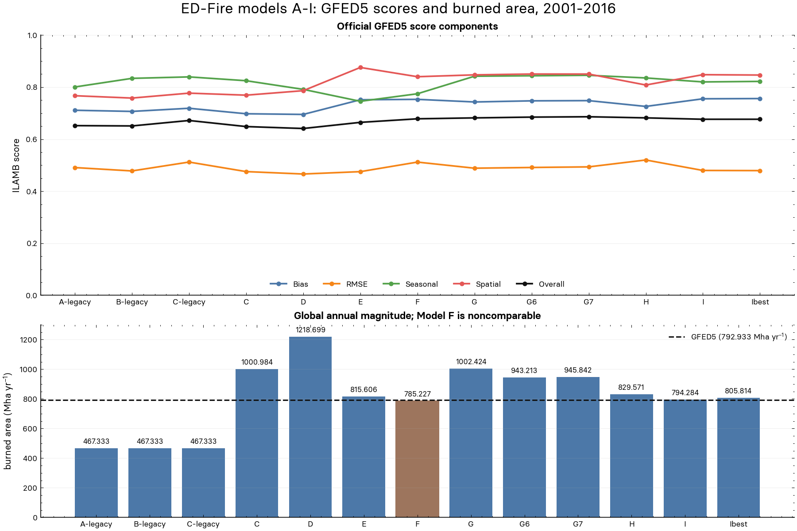
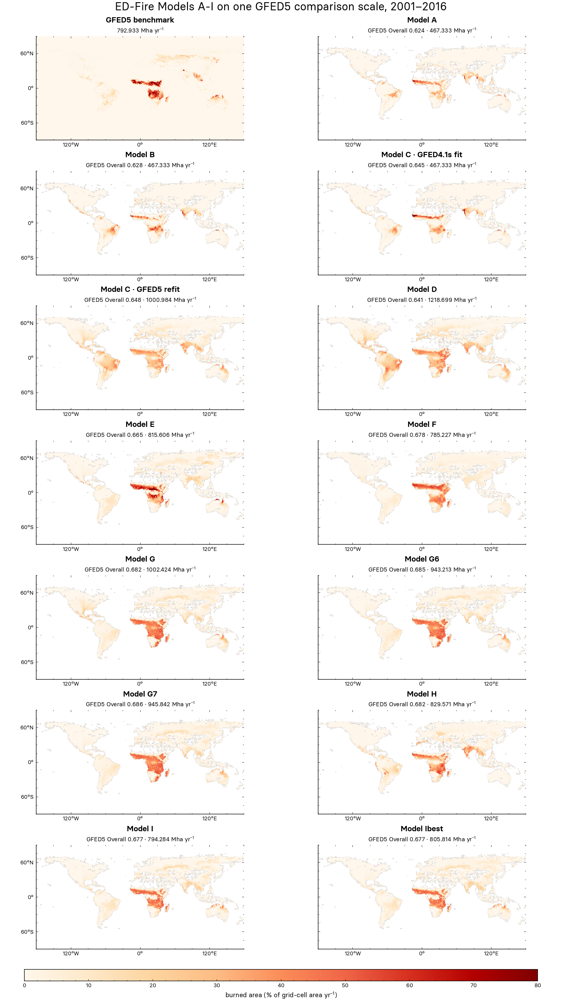

# Question

Can the retained ED-Fire Models A-I be regenerated from the recovered code, parameters, and project data, and can every variant be presented through the same fixed six-figure comparison suite?

# Rationale

Models A-I are the work this project is extending, but their evidence is currently split across branch history, parameter files, replay metrics, and a figure suite rendered only for Ibest. Before choosing which mechanism to extend, the project needs one recorded experiment that proves which variants reproduce, preserves their exact limitations, and makes their results directly comparable without renaming them as an external model collection.

# Change

This experiment changes no model equations or parameters. It replays the thirteen retained variants in their recorded protocols, checks their output and score identities, evaluates every output against GFED5 and GFED4.1s, and renders the same deterministic SciencePlots suite for each model. It records the original benchmark-fed construction boundary instead of presenting the reproduced outputs as new clean candidates.

# Prediction

All thirteen variants should produce hash-recorded NetCDF outputs and pass their replay checks. Model A should remain a partial source reconstruction, Model H should retain its documented seasonal phase-tie drift, and Model F should remain reproducible but noncomparable as an unconstrained candidate. The run should preserve 78 canonical per-model figures and two A-I overview figures while leaving every protected input, benchmark, parameter inventory, evaluator, and renderer unchanged.

# Plan

The adapter will regenerate all models inside the run’s work directory, run the recorded protocol evaluations, then evaluate each model against both GFED products through the v2 comparison interface. The trusted evaluator will reject a missing model, failed replay check, changed output hash, incomplete suite, wrong image dimensions, changed benchmark, or missing method-boundary flag. The durable record will contain the replay metrics, verification report, model index, suite manifest, and six PNGs for each model. Stop after one complete run; any repair receives a separate run ID.

# Result

The [selected reproduction run](runs/run.20260819T113431Z.96777d94/run.json) completed in 22 minutes 28 seconds. It regenerated all thirteen retained variants, reproduced their archived protocol evaluations, evaluated every resulting field against both GFED products, and left every protected source, parameter, input, benchmark, evaluator, and renderer unchanged. All thirteen replay verifications passed. The evaluator retained 78 canonical per-model figures, thirteen suite manifests, two overview figures, the replay metrics, the verification report, and an index tying every model to its output hash and evidence.

The table reports the standardized v2 Overall scores to three decimal places. Full precision remains in the selected run's JSON and CSV evidence.

| Model record | Replay result | GFED5 Overall | GFED4.1s Overall |
| --- | --- | ---: | ---: |
| Model A (`A-legacy`) | Pass; partial source reconstruction | 0.624 | 0.652 |
| Model B (`B-legacy`) | Pass; reproduced | 0.628 | 0.651 |
| Model C, GFED4.1s fit (`C-legacy`) | Pass; reproduced | 0.645 | 0.672 |
| Model C, GFED5 refit (`C`) | Pass; reproduced | 0.648 | 0.655 |
| Model D | Pass; reproduced | 0.641 | 0.630 |
| Model E | Pass; reproduced | 0.665 | 0.639 |
| Model F | Pass; reproduced but noncomparable | 0.678 | 0.683 |
| Model G | Pass; reproduced | 0.682 | 0.661 |
| Model G6 | Pass; reproduced | 0.685 | 0.665 |
| Model G7 | Pass; reproduced | 0.686 | 0.667 |
| Model H | Pass; reproduced in this pinned run | 0.682 | 0.675 |
| Model I | Pass; reproduced | 0.677 | 0.669 |
| Model Ibest | Pass; exploratory hybrid | 0.677 | 0.669 |

Model G7 has the highest standardized GFED5 Overall score in this retained set at 0.686. That comparison does not promote G7 as a clean future candidate: the recovered generators retain benchmark-derived construction that the current candidate contract forbids. The historical name `Ibest` identifies the archived hybrid; it does not mean that it is the highest scorer under this standardized comparison.

Model H reproduced its archived GFED5 Seasonal score of 0.835 and Overall score of 0.682 in this pinned run. The earlier macOS replay's 0.001 seasonal phase-tie difference therefore did not recur, although the registry retains that platform-sensitivity warning. Model A passed the checks available for its recovered implementation but remains partial because its exact frozen LAI artifact was never committed. Model F is reproducible, but its unconstrained construction remains noncomparable as a clean candidate.

# Evidence

The [selected reproduction run](runs/run.20260819T113431Z.96777d94/run.json) supplies the evidence below.

## Overview figures

This figure compares the five standardized GFED5 score components and the global burned-area magnitude for every retained variant. The fixed model order and scales make the progression visible without implying that all generators satisfy the current clean-candidate rules.

This 1800 × 3200 presentation places GFED5 and all thirteen model fields in a two-column sheet. Every map keeps its 2:1 geographic aspect, and the shared 0–80 percent-per-year scale sits directly below the maps. It is regenerated from the selected run with `uv run --extra historical python scripts/render_models_overview.py experiment.models-a-i-reproduction`; the original run-owned overview remains unchanged.

## Per-model figure suites

Every row links to the same six-figure suite. Scores, map scales, region order, density windows, and benchmark-sensitivity limits are fixed by the renderer rather than adjusted for a model.

| Model | Scores | Mean fields | Differences | Seasonal cycles | Spatial distribution | Benchmark sensitivity |
| --- | --- | --- | --- | --- | --- | --- |
| A | [Open](runs/run.20260819T113431Z.96777d94/artifacts/models/A-legacy/01-score-summary.png) | [Open](runs/run.20260819T113431Z.96777d94/artifacts/models/A-legacy/02a-mean-burned-area.png) | [Open](runs/run.20260819T113431Z.96777d94/artifacts/models/A-legacy/02b-burned-area-differences.png) | [Open](runs/run.20260819T113431Z.96777d94/artifacts/models/A-legacy/03-seasonal-cycles.png) | [Open](runs/run.20260819T113431Z.96777d94/artifacts/models/A-legacy/04-spatial-distribution.png) | [Open](runs/run.20260819T113431Z.96777d94/artifacts/models/A-legacy/05-benchmark-sensitivity.png) |
| B | [Open](runs/run.20260819T113431Z.96777d94/artifacts/models/B-legacy/01-score-summary.png) | [Open](runs/run.20260819T113431Z.96777d94/artifacts/models/B-legacy/02a-mean-burned-area.png) | [Open](runs/run.20260819T113431Z.96777d94/artifacts/models/B-legacy/02b-burned-area-differences.png) | [Open](runs/run.20260819T113431Z.96777d94/artifacts/models/B-legacy/03-seasonal-cycles.png) | [Open](runs/run.20260819T113431Z.96777d94/artifacts/models/B-legacy/04-spatial-distribution.png) | [Open](runs/run.20260819T113431Z.96777d94/artifacts/models/B-legacy/05-benchmark-sensitivity.png) |
| C, GFED4.1s fit | [Open](runs/run.20260819T113431Z.96777d94/artifacts/models/C-legacy/01-score-summary.png) | [Open](runs/run.20260819T113431Z.96777d94/artifacts/models/C-legacy/02a-mean-burned-area.png) | [Open](runs/run.20260819T113431Z.96777d94/artifacts/models/C-legacy/02b-burned-area-differences.png) | [Open](runs/run.20260819T113431Z.96777d94/artifacts/models/C-legacy/03-seasonal-cycles.png) | [Open](runs/run.20260819T113431Z.96777d94/artifacts/models/C-legacy/04-spatial-distribution.png) | [Open](runs/run.20260819T113431Z.96777d94/artifacts/models/C-legacy/05-benchmark-sensitivity.png) |
| C, GFED5 refit | [Open](runs/run.20260819T113431Z.96777d94/artifacts/models/C/01-score-summary.png) | [Open](runs/run.20260819T113431Z.96777d94/artifacts/models/C/02a-mean-burned-area.png) | [Open](runs/run.20260819T113431Z.96777d94/artifacts/models/C/02b-burned-area-differences.png) | [Open](runs/run.20260819T113431Z.96777d94/artifacts/models/C/03-seasonal-cycles.png) | [Open](runs/run.20260819T113431Z.96777d94/artifacts/models/C/04-spatial-distribution.png) | [Open](runs/run.20260819T113431Z.96777d94/artifacts/models/C/05-benchmark-sensitivity.png) |
| D | [Open](runs/run.20260819T113431Z.96777d94/artifacts/models/D/01-score-summary.png) | [Open](runs/run.20260819T113431Z.96777d94/artifacts/models/D/02a-mean-burned-area.png) | [Open](runs/run.20260819T113431Z.96777d94/artifacts/models/D/02b-burned-area-differences.png) | [Open](runs/run.20260819T113431Z.96777d94/artifacts/models/D/03-seasonal-cycles.png) | [Open](runs/run.20260819T113431Z.96777d94/artifacts/models/D/04-spatial-distribution.png) | [Open](runs/run.20260819T113431Z.96777d94/artifacts/models/D/05-benchmark-sensitivity.png) |
| E | [Open](runs/run.20260819T113431Z.96777d94/artifacts/models/E/01-score-summary.png) | [Open](runs/run.20260819T113431Z.96777d94/artifacts/models/E/02a-mean-burned-area.png) | [Open](runs/run.20260819T113431Z.96777d94/artifacts/models/E/02b-burned-area-differences.png) | [Open](runs/run.20260819T113431Z.96777d94/artifacts/models/E/03-seasonal-cycles.png) | [Open](runs/run.20260819T113431Z.96777d94/artifacts/models/E/04-spatial-distribution.png) | [Open](runs/run.20260819T113431Z.96777d94/artifacts/models/E/05-benchmark-sensitivity.png) |
| F | [Open](runs/run.20260819T113431Z.96777d94/artifacts/models/F/01-score-summary.png) | [Open](runs/run.20260819T113431Z.96777d94/artifacts/models/F/02a-mean-burned-area.png) | [Open](runs/run.20260819T113431Z.96777d94/artifacts/models/F/02b-burned-area-differences.png) | [Open](runs/run.20260819T113431Z.96777d94/artifacts/models/F/03-seasonal-cycles.png) | [Open](runs/run.20260819T113431Z.96777d94/artifacts/models/F/04-spatial-distribution.png) | [Open](runs/run.20260819T113431Z.96777d94/artifacts/models/F/05-benchmark-sensitivity.png) |
| G | [Open](runs/run.20260819T113431Z.96777d94/artifacts/models/G/01-score-summary.png) | [Open](runs/run.20260819T113431Z.96777d94/artifacts/models/G/02a-mean-burned-area.png) | [Open](runs/run.20260819T113431Z.96777d94/artifacts/models/G/02b-burned-area-differences.png) | [Open](runs/run.20260819T113431Z.96777d94/artifacts/models/G/03-seasonal-cycles.png) | [Open](runs/run.20260819T113431Z.96777d94/artifacts/models/G/04-spatial-distribution.png) | [Open](runs/run.20260819T113431Z.96777d94/artifacts/models/G/05-benchmark-sensitivity.png) |
| G6 | [Open](runs/run.20260819T113431Z.96777d94/artifacts/models/G6/01-score-summary.png) | [Open](runs/run.20260819T113431Z.96777d94/artifacts/models/G6/02a-mean-burned-area.png) | [Open](runs/run.20260819T113431Z.96777d94/artifacts/models/G6/02b-burned-area-differences.png) | [Open](runs/run.20260819T113431Z.96777d94/artifacts/models/G6/03-seasonal-cycles.png) | [Open](runs/run.20260819T113431Z.96777d94/artifacts/models/G6/04-spatial-distribution.png) | [Open](runs/run.20260819T113431Z.96777d94/artifacts/models/G6/05-benchmark-sensitivity.png) |
| G7 | [Open](runs/run.20260819T113431Z.96777d94/artifacts/models/G7/01-score-summary.png) | [Open](runs/run.20260819T113431Z.96777d94/artifacts/models/G7/02a-mean-burned-area.png) | [Open](runs/run.20260819T113431Z.96777d94/artifacts/models/G7/02b-burned-area-differences.png) | [Open](runs/run.20260819T113431Z.96777d94/artifacts/models/G7/03-seasonal-cycles.png) | [Open](runs/run.20260819T113431Z.96777d94/artifacts/models/G7/04-spatial-distribution.png) | [Open](runs/run.20260819T113431Z.96777d94/artifacts/models/G7/05-benchmark-sensitivity.png) |
| H | [Open](runs/run.20260819T113431Z.96777d94/artifacts/models/H/01-score-summary.png) | [Open](runs/run.20260819T113431Z.96777d94/artifacts/models/H/02a-mean-burned-area.png) | [Open](runs/run.20260819T113431Z.96777d94/artifacts/models/H/02b-burned-area-differences.png) | [Open](runs/run.20260819T113431Z.96777d94/artifacts/models/H/03-seasonal-cycles.png) | [Open](runs/run.20260819T113431Z.96777d94/artifacts/models/H/04-spatial-distribution.png) | [Open](runs/run.20260819T113431Z.96777d94/artifacts/models/H/05-benchmark-sensitivity.png) |
| I | [Open](runs/run.20260819T113431Z.96777d94/artifacts/models/I/01-score-summary.png) | [Open](runs/run.20260819T113431Z.96777d94/artifacts/models/I/02a-mean-burned-area.png) | [Open](runs/run.20260819T113431Z.96777d94/artifacts/models/I/02b-burned-area-differences.png) | [Open](runs/run.20260819T113431Z.96777d94/artifacts/models/I/03-seasonal-cycles.png) | [Open](runs/run.20260819T113431Z.96777d94/artifacts/models/I/04-spatial-distribution.png) | [Open](runs/run.20260819T113431Z.96777d94/artifacts/models/I/05-benchmark-sensitivity.png) |
| Ibest | [Open](runs/run.20260819T113431Z.96777d94/artifacts/models/Ibest/01-score-summary.png) | [Open](runs/run.20260819T113431Z.96777d94/artifacts/models/Ibest/02a-mean-burned-area.png) | [Open](runs/run.20260819T113431Z.96777d94/artifacts/models/Ibest/02b-burned-area-differences.png) | [Open](runs/run.20260819T113431Z.96777d94/artifacts/models/Ibest/03-seasonal-cycles.png) | [Open](runs/run.20260819T113431Z.96777d94/artifacts/models/Ibest/04-spatial-distribution.png) | [Open](runs/run.20260819T113431Z.96777d94/artifacts/models/Ibest/05-benchmark-sensitivity.png) |

## Results and provenance

[Complete experiment metrics](runs/run.20260819T113431Z.96777d94/metrics.json)

[Model-to-output and figure index](runs/run.20260819T113431Z.96777d94/artifacts/model-index.json)

[Original protocol replay metrics](runs/run.20260819T113431Z.96777d94/artifacts/replay-metrics.csv)

[Replay verification report](runs/run.20260819T113431Z.96777d94/artifacts/replay-verification.json)

[Frozen evaluation contract](runs/run.20260819T113431Z.96777d94/contract.json)

# Interpretation

The recovered A-I work is executable evidence rather than a loose file collection. Its model fields, archived score checks, standardized benchmark comparisons, and complete figure suites can be regenerated together under one recorded experiment. The resulting score progression is now useful for deciding which mechanisms and parameters deserve a clean reimplementation. It is not evidence that the recovered output generators themselves satisfy the current no-leakage boundary.

The highest retained GFED5 score belongs to G7, while I and Ibest trade slightly lower Overall scores for near-zero global bias. That is a concrete design tension for the next mechanism experiment, not a reason to choose by name or by one scalar alone. GFED4.1s changes the relative picture enough to remain useful as a sensitivity diagnostic, but GFED5 remains the declared optimization objective.

# Decision

Close the A-I reproduction as completed and keep it as the comparison record for the work this project is extending. A new mechanistic experiment may cite one or more of these models directly in its rationale and reuse a recovered mechanism or parameter set, but it must remove benchmark-fed output construction and emit an ordinary candidate through the active evaluation contract. The A-I variants should not be rerun as ad hoc files outside this experiment when their existing evidence is sufficient.

# Revisit when

Repeat the reproduction if a retained parameter artifact, model generator, model input, ILAMB implementation, benchmark identity, or canonical renderer changes. A later experiment that changes a mechanism should refer to the relevant model here and produce a clean candidate under its own contract. Revisit Model H's warning if the same pinned environment produces a different phase tie or if the archived tie-breaking rule is made platform-invariant.
