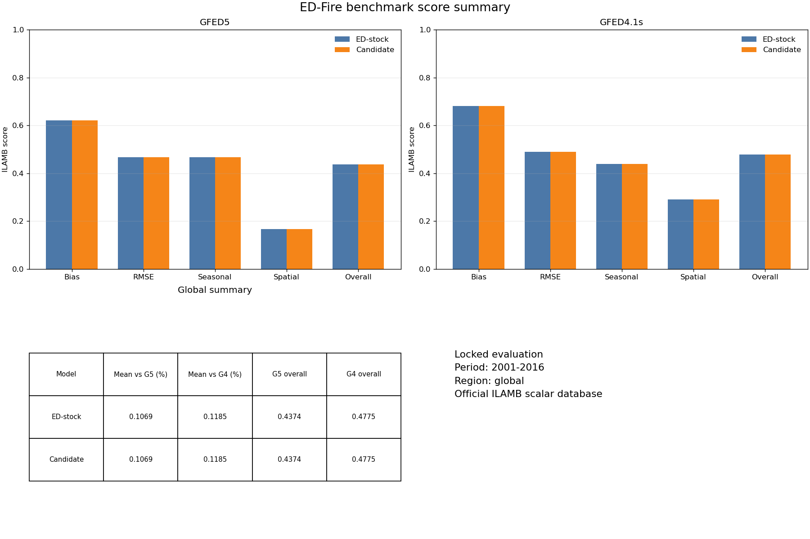
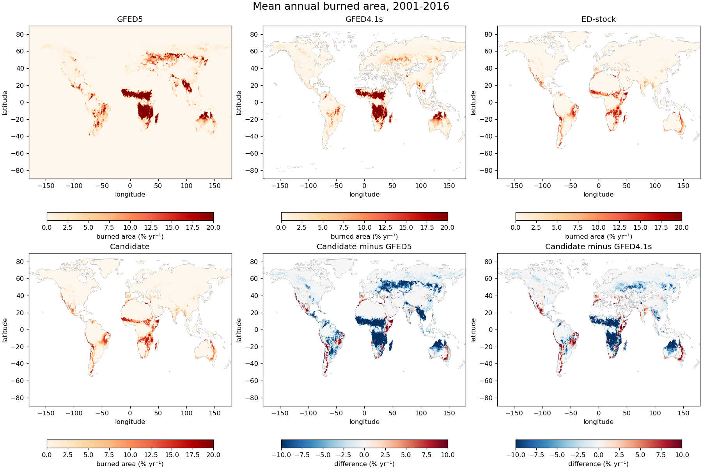
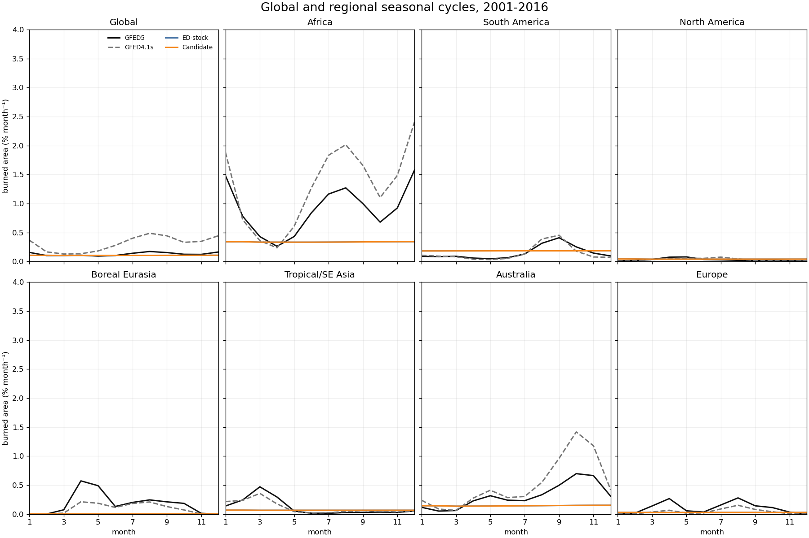
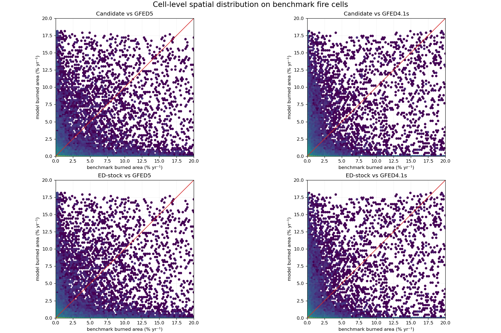
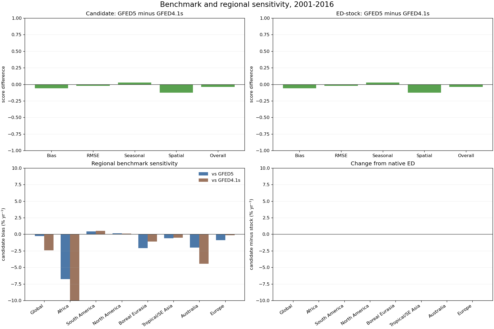

# Question

Can the pinned native ED burned-area output produce a reproducible comparison against GFED5 and GFED4.1s without using Model A through E assets?

# Rationale

This control was required before proposing another fire mechanism because the project needed one trusted evaluation floor, one fixed candidate interface, and evidence that the same committed state produces the same metrics and figures. Without it, a later score change could not be separated from evaluator, staging, or presentation drift.

# Change

This experiment introduces no scientific change. It stages the pinned TRENDY v14 EDv3 S3 native output and passes it to the locked ILAMB evaluator. The native ED source revision and producing command are not present, so this is an evaluation baseline rather than source-level reproduction.

# Prediction

The run should reproduce the same GFED5 score vector already associated with the pinned file, add a matched GFED4.1s score vector, and generate the five contract figures. It must not be interpreted as a candidate-model improvement or as proof that native ED can be rebuilt here.

# Plan

Expected evidence is the staged candidate hash, both complete ILAMB score vectors, the five canonical figures, command logs, environment identity, and unchanged protected-file hashes. Likely failures are a missing source link, an incompatible ILAMB environment, candidate-interface drift, or evaluator output that violates the contract. One run costs roughly two minutes on this machine. Stop after one complete run and one matched repeat at the same revision; invalidate any attempt that changes project or protected files.

# Result

Three terminal runs completed. The initial run, `run.20260818T170639Z.ed6f7759`, established the result at revision `8cda0eff2c520570f9c0c73f04533936ae63c0f6`. After removing a duplicate evaluator entry from run-lock bookkeeping, `run.20260818T171022Z.bc08c8d2` and `run.20260818T171220Z.a7122045` repeated the experiment at the identical revision `d1518e88f03c371303bd06d9ff767d6ea1ee3358`. Both commands exited successfully, protected hashes passed before and after evaluation, the worktree remained unchanged, and no failure was recorded.

The matched runs produced byte-identical `metrics.json` files with SHA-256 `053901e8c5f0d5552c593582f3d7d5bc28b5322a1313c811b6eddece0f8d52bd`. Their staged candidate files were byte-identical to the pinned native ED artifact with SHA-256 `73c07a379ab25a04eb3d55a9ccc7e8671ddac334f2e7bdeeb409aaa59be9caeb`. Both ILAMB scalar databases, both score files, and all five canonical figures also matched byte for byte. Each figure is 1800 × 1200 and was visually checked for complete panels, readable labels, consistent scales, and obvious rendering failures. The run-specific `evaluation.json` files differ only where they record each attempt's unique absolute working paths.

Because the candidate is the pinned stock file by construction, the candidate and ED-stock evidence vectors are identical. This is the intended control rather than a model improvement.

| Metric | GFED5 | GFED4.1s |
| --- | ---: | ---: |
| Benchmark-period mean burned area (%) | 0.487444 | 0.327110 |
| Model-period mean burned area (%) | 0.106925 | 0.118507 |
| Bias (%) | -0.380519 | -0.208603 |
| Bias score | 0.621668 | 0.680670 |
| RMSE (%) | 0.869637 | 0.643489 |
| RMSE score | 0.466119 | 0.488924 |
| Seasonal-cycle score | 0.467363 | 0.438590 |
| Spatial-distribution score | 0.165780 | 0.290408 |
| Overall score | 0.437410 | 0.477503 |
| Phase shift (months) | 2.784130 | 3.224500 |

The overall score changes by -0.040093 when the benchmark changes from GFED4.1s to GFED5. The stock field underestimates the global mean under both products, and spatial distribution is the weakest scalar component, especially against GFED5. Those are research targets for a future mechanism; they are not reasons to alter the locked evaluator.

# Evidence

The selected record is the final matched repeat, `run.20260818T171220Z.a7122045`. These are the curated scientific outputs for the experiment reader; the run directory retains the complete provenance record.

## Figures

## Results and outputs

[Complete metric vector](runs/run.20260818T171220Z.a7122045/metrics.json)

[Evaluation record](runs/run.20260818T171220Z.a7122045/artifacts/evaluation.json)

[GFED5 ILAMB scores](runs/run.20260818T171220Z.a7122045/artifacts/ilamb/gfed5/scores.csv)

[GFED4.1s ILAMB scores](runs/run.20260818T171220Z.a7122045/artifacts/ilamb/gfed4_1s/scores.csv)

[Evaluated stock burned-area field](runs/run.20260818T171220Z.a7122045/artifacts/model-output/burntArea.nc)

# Interpretation

The matched repeats show that the pinned stock field can be staged and evaluated deterministically under the preserved v1 contract. They establish a reliable comparison floor and expose the stock field's largest measured weaknesses, but they do not establish source-level reproducibility because the producing ED revision, build, input selection, and command remain unknown.

# Decision

Close the baseline as completed. The evaluation floor and canonical presentation are reproducible, but the experiment does not supply an editable ED fire implementation. The next model experiment must begin from the relevant version-controlled ED fire source and configuration or from a clean, reviewable mechanistic implementation that emits the same candidate interface. It should isolate one process and predict its regional and seasonal effect before execution. Do not introduce Optuna until that direct candidate and its development objective reproduce.

# Revisit when

Reopen the setup if the pinned stock output, benchmark product, ILAMB version, period, region boxes, score definition, or figure contract changes.
